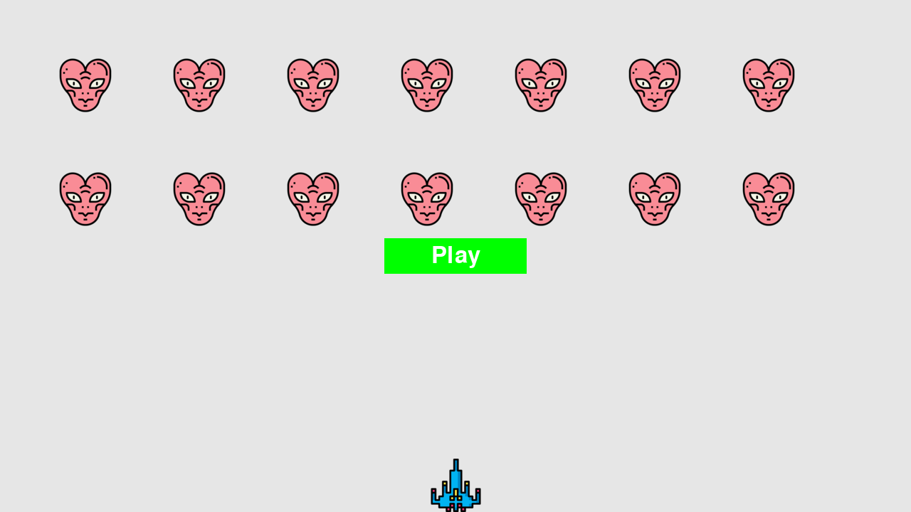

# Практическая работа №2
## Выполнила: Гиниятуллина Юлия Сергеевна, ИВТ 3 курс, 2.2

Ход игры описан в файле alien_invasion.py.

Созданы классы Ship, Bullet, Alien, Settings, Button, Game_Stats и размещены в соответствующих файлах для оптимизации.

Создано игровое окно, разработан основной цикл игры, добавлен конец игры и ограничения.

Результат работы:
